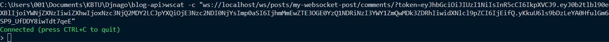

# Blog API

This repository is dedicated for project from "Advanced Django" subject in KBTU university.

## Setup

1. `pip install -r requirements/dev.txt`
2. `cp settings/.env.example settings/.env` (and fill it in)
3. `python manage.py migrate`
4. `python manage.py runserver`

## ERD


## Features

- JWT Auth
- Redis Caching & Throttling
- Pub/Sub for comments

## Homework 4 Verification

This document outlines the verification steps for the nginx reverse proxy implementation. All tests confirm that nginx is correctly configured as a reverse proxy, serving static files, and handling WebSocket connections.

### Prerequisites

- Docker and Docker Compose installed
- All services running: `docker compose up -d`
- Wait 30 seconds for full initialization

### Verification Tests

#### **1. Nginx Serves the Application**

- Test that nginx is properly serving the Django application on port 80:

```bash
curl -I http://localhost/admin/login/
```

- Expected Output:

```
HTTP/1.1 200 OK
Server: nginx/1.27.5
Date: ...
Content-Type: text/html; charset=utf-8
```

#### **2. Static Files with Cache Headers**

- Verify that static files are served directly by nginx with proper caching headers:

```bash
curl -I http://localhost/static/admin/css/base.css
```

- Expected Output:

```
HTTP/1.1 200 OK
Server: nginx/1.27.5
Cache-Control: max-age=2592000
Cache-Control: public, max-age=2592000
Content-Type: text/css
```

#### **3. API Endpoint Returns JSON**

- Confirm that API requests are properly proxied to Django:

```bash
curl http://localhost/api/posts/
```

- Expected Output:

```
{"count":0,"next":null,"previous":null,"results":[]}
```

#### **4. Nginx Returns 502 When Web Service is Down**

- Test that nginx properly handles backend failures:

```bash
# Stop the web service
docker-compose stop web

# Wait a moment
sleep 3

# Test the API through nginx
curl -I http://localhost/api/posts/

# Restart the web service
docker-compose start web
```

- Expected Output:

```
HTTP/1.1 502 Bad Gateway
Server: nginx/1.27.5
Content-Type: text/html
```

#### **5. Port 8000 is Not Directly Accessible**

- Verify that the web service port is not exposed to the host:

```bash
# Stop the web service
curl http://localhost:8000/
```

- Expected Output:

```
curl: (7) Failed to connect to localhost port 8000: Connection refused
```

#### **6. WebSocket Connection Upgrades with 101**

```bash
wscat -c "ws://localhost/ws/posts/my-websocket-post/comments/?token=eyJhbGciOiJIUzI1NiIsInR5cCI6IkpXVCJ9..."
```

- Expected Output:

```
Connected (press CTRL+C to quit)
```


